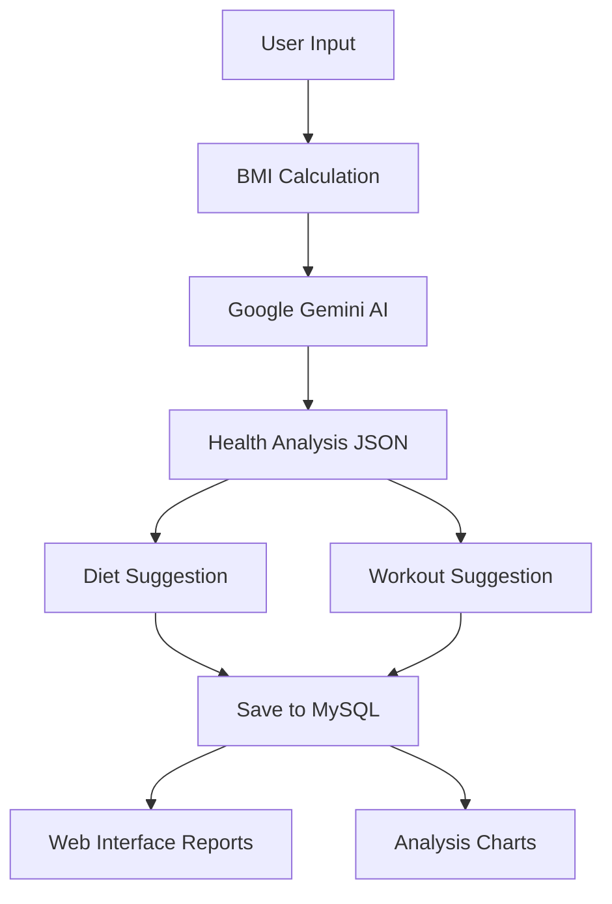
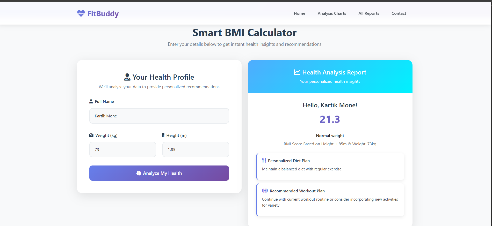

#  AI-Powered BMI Calculator & Health Assistant


---

##  Overview

This project is an **AI-powered BMI Calculator & Health Assistant** that uses **Google Gemini AI** to generate **personalized health insights, diet plans, and workout recommendations**.
It provides a modern **Flask backend with MySQL storage** and a **responsive frontend** built with HTML, CSS, JS, and Bootstrap.

Users can:

* Calculate their BMI instantly
* Get **AI-generated diet & workout suggestions**
* View **all reports** in a card-based UI
* Explore BMI trends using **interactive charts**

---

## Features

|    Feature                     |  Description                                        |
| ------------------------------ | ----------------------------------------------------- |
| **Smart BMI Calculation**   | Calculates BMI & categorizes health status            |
| **AI-Powered Suggestions**  | Uses Google Gemini for diet & workout recommendations |
| **Personalized Diet Plans** | Tailored to BMI category                              |
| **Custom Workout Plans**    | Fitness goals matched with routines                   |
| **MySQL Database**         | Stores BMI records securely                           |
| **Dashboard Analytics**     | BMI trends with Chart.js visualizations               |
| **Responsive Frontend**     | Built with Bootstrap & custom CSS                     |
| **REST APIs**                | Flask endpoints for reports & analytics               |

---

## AI Workflow



---

##  API Endpoints

###  Add BMI Report

**POST** `/bmi/add`

Request (Form Data):

```json
{
  "name": "John Doe",
  "weight": 70,
  "height": 1.75
}
```

Response:

```json
{
  "status": "success",
  "bmi_report": {
    "name": "John Doe",
    "weight": 70,
    "height": 1.75,
    "bmi": 22.86,
    "bmi_status": "Normal",
    "diet_suggestion": "Balanced diet with fruits, vegetables, and lean protein",
    "workout_suggestion": "30 min cardio 3x per week + strength training"
  }
}
```

---

###  Get All Reports

**GET** `/bmi/all`

Response:

```json
[
  {
    "name": "John Doe",
    "weight": 70,
    "height": 1.75,
    "bmi": 22.86,
    "bmi_status": "Normal",
    "diet_suggestion": "Balanced diet...",
    "workout_suggestion": "30 min cardio..."
  }
]
```

---

##  Project Structure

```
├── app.py                # Flask backend with API + Gemini integration
├── Web_Interface.html     # Main BMI calculator (form + results)
├── All_BMIS.html          # Card-based list of all BMI reports
├── Analysis_BMI.html      # BMI dashboard with Chart.js
└── .env                   # API keys + DB credentials (ignored in Git)
```

---

##  File Details

| File                     | Purpose                                           |
| ------------------------ | ------------------------------------------------- |
| **`app.py`**             | Flask server, routes, MySQL integration, AI calls |
| **`Web_Interface.html`** | Main user interface with BMI form + results       |
| **`All_BMIS.html`**      | Displays all BMI reports in styled cards          |
| **`Analysis_BMI.html`**  | BMI trend visualization using Chart.js            |

---

## Technologies Used

* **Backend**: Flask, PyMySQL, Google Gemini API
* **Database**: MySQL (Aiven Cloud compatible)
* **Frontend**: HTML5, CSS3, Bootstrap, JavaScript
* **Visualization**: Chart.js
* **AI**: Google Gemini (Generative AI for recommendations)

---

## Example Database Schema

```sql
CREATE TABLE bmi_reports (
    id INT AUTO_INCREMENT PRIMARY KEY,
    name VARCHAR(100),
    weight FLOAT,
    height FLOAT,
    bmi FLOAT,
    bmi_status VARCHAR(50),
    diet_suggestion TEXT,
    workout_suggestion TEXT,
    created_at TIMESTAMP DEFAULT CURRENT_TIMESTAMP
);
```

---

##  Issues & Support

*  [Report Bug](https://github.com/kartik-mone/ai-bmi-calculator/issues/new?template=bug_report.md)
*  [Request Feature](https://github.com/kartik-mone/ai-bmi-calculator/issues/new?template=feature_request.md)
*  Contact: [kartikmmone12@gmail.com](mailto:kartikmmone12@gmail.com)

---

##  Roadmap

* [ ] Add **User Authentication**
* [ ] Advanced analytics (BMI history, trends)
* [ ] Nutrition & calorie tracking
* [ ] Mobile-friendly PWA / Native apps
* [ ] Multi-language support
* [ ] Integration with wearables

---

## Image



##  License

MIT License © 2025 **chilled\_sweet\_**

---

##  Acknowledgments

*  **Google AI Team** – Gemini API
*  **MySQL** – Reliable storage
*  **Flask Community** – Backend framework
*  **Bootstrap + Chart.js** – UI & data viz

---

 **"Your AI-Powered Path to Better Health"**

